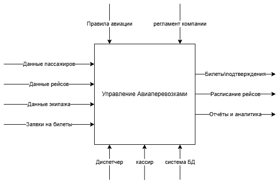
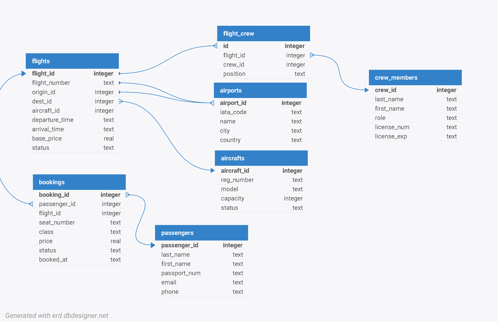
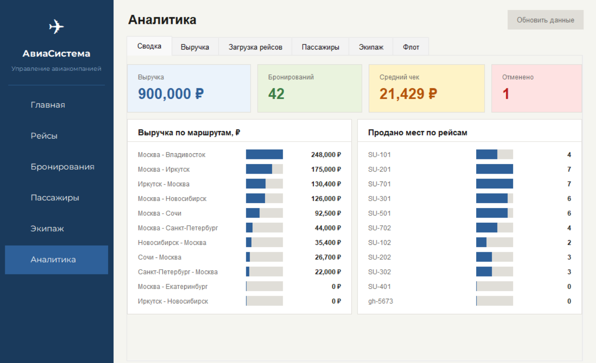
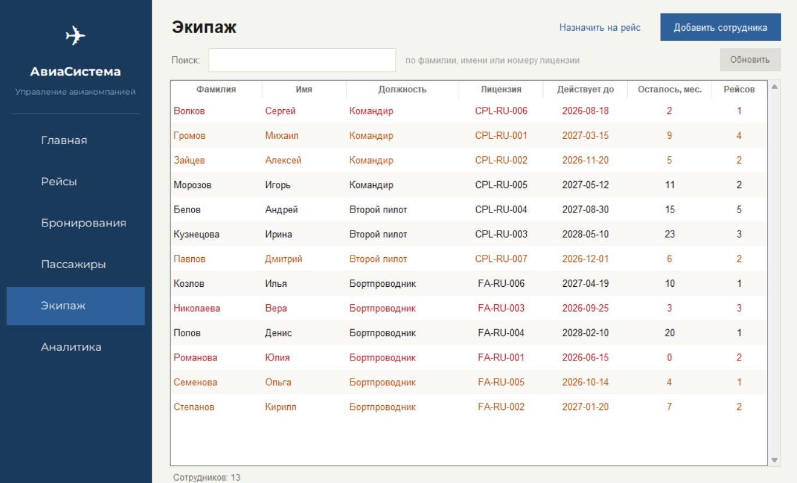
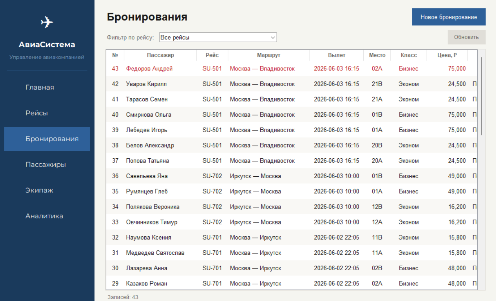

# Отчёт по проекту БД: Информационная система авиакомпании

---

## 1. Целевая аудитория и типовые задачи

**Целевая аудитория** — сотрудники небольшой региональной авиакомпании или чартерного перевозчика: диспетчеры, сотрудники продаж билетов, HR-отдел (управление экипажами), аналитики.

**Типовые задачи, которые решает БД:**

- Поиск свободных мест на рейс и оформление бронирования
- Проверка паспортных данных пассажира при регистрации
- Назначение экипажа на рейс с учётом роли (КВС, второй пилот, бортпроводник)
- Контроль статуса воздушного судна (active / maintenance / retired)
- Отслеживание выручки по маршрутам и отдельным рейсам
- Мониторинг загрузки кресел (процент заполненности по классам)
- Предупреждение об истечении лицензий у членов экипажа
- Рейтинг пассажиров по общим расходам (программа лояльности)

---

## 2. Аналоги на рынке

| Система | СУБД / архитектура | Ключевые возможности |
|---|---|---|
| **Sabre SynXis** | Oracle, клиент-серверная | Глобальное управление бронированием, интеграция с GDS |
| **Amadeus Altéa** | Oracle RAC, SOA | Инвентаризация рейсов, регистрация, прогнозирование загрузки |
| **OpenSkies** | PostgreSQL, REST API | Open-source основа для небольших перевозчиков |
| **AeroCRS** | MySQL, web | Облачная система для чартеров и лоукостеров |

Разрабатываемая система ориентирована на локальное использование (SQLite), имеет настольный GUI на Python/Tkinter и покрывает базовые операционные задачи малого перевозчика без интеграции с GDS.

---

## 3. Описание процесса в нотации IDEF0

### A-0 — Контекстная диаграмма (верхний уровень)



---

### A1–A4 — Декомпозиция первого уровня

#### A1: Управление рейсами

```
ВХОД:  Аэропорты отправления/прибытия, тип ВС, время вылета
ВЫХОД: Расписание рейса, статус (scheduled / departed / arrived / cancelled)
МЕХАНИЗМ: Диспетчер, таблицы flights + airports + aircrafts
```

**Подфункции:**
- A1.1 Создание рейса (назначение маршрута, ВС, времени)
- A1.2 Изменение статуса рейса
- A1.3 Отмена рейса (каскадное обновление бронирований)

---

#### A2: Управление бронированиями

```
ВХОД:  Запрос на бронирование (пассажир + рейс + класс)
ВЫХОД: Подтверждённое место, номер брони, цена билета
МЕХАНИЗМ: Кассир / онлайн-форма, таблицы bookings + passengers + flights
```

**Подфункции:**
- A2.1 Регистрация пассажира (если новый)
- A2.2 Проверка наличия свободных мест
- A2.3 Расчёт цены (базовая цена + надбавка за класс)
- A2.4 Фиксация бронирования, генерация номера места
- A2.5 Отмена бронирования (статус → cancelled)

---

#### A3: Управление экипажем

```
ВХОД:  Данные о члене экипажа, рейс для назначения
ВЫХОД: Назначение экипажа на рейс, предупреждения об истекающих лицензиях
МЕХАНИЗМ: HR-менеджер, таблицы crew_members + flight_crew
```

**Подфункции:**
- A3.1 Ведение справочника членов экипажа
- A3.2 Назначение на рейс (с указанием позиции: Captain / Co-pilot / Attendant)
- A3.3 Контроль сроков лицензий

---

#### A4: Отчётность и аналитика

```
ВХОД:  Данные бронирований, рейсов, ВС
ВЫХОД: Финансовые отчёты, отчёты по загрузке, рейтинги пассажиров
МЕХАНИЗМ: Аналитик, модуль report_model
```

**Подфункции:**
- A4.1 Выручка по рейсам и маршрутам
- A4.2 Процент заполненности ВС
- A4.3 Разбивка по классам обслуживания
- A4.4 Рейтинг пассажиров (программа лояльности)
- A4.5 Нагрузка на экипаж

---

## 4. Схема данных



## 5. Файл БД

СУБД: **SQLite 3**  
Файл: `database/airline.db`  
Схема: `database/schema.sql`  
Загрузка данных: `database/seed_loader.py`

---

## 6. Интерфейс (описание модулей GUI)

Реализован на **Python + Tkinter**. Точка входа — `main.py`.

| Модуль | Файл | Функциональность |
|---|---|---|
| Главное окно | `gui/main_window.py` | Навигация, кнопочная форма, сводные виджеты |
| Рейсы | `gui/flights_window.py` | Просмотр, создание, смена статуса рейса |
| Бронирования | `gui/bookings_window.py` | Поиск, создание, отмена брони |
| Пассажиры | `gui/passengers_window.py` | Справочник пассажиров, поиск по паспорту |
| Экипаж | `gui/crew_window.py` | Справочник, назначения на рейс |
| Отчёты | `gui/reports_window.py` | 8 аналитических отчётов с таблицами |

---

## 7. SQL-запросы

### 7.1 Простые выборки

```sql
-- Все активные рейсы с маршрутом
SELECT
    f.flight_number,
    a1.city AS from_city,
    a2.city AS to_city,
    f.departure_time,
    f.status
FROM flights f
JOIN airports a1 ON f.origin_id = a1.airport_id
JOIN airports a2 ON f.dest_id = a2.airport_id
WHERE f.status = 'scheduled'
ORDER BY f.departure_time;
```

```sql
-- Все бронирования конкретного пассажира по паспорту
SELECT
    b.booking_id,
    f.flight_number,
    a1.city || ' → ' || a2.city AS route,
    b.seat_number,
    b.class,
    b.price,
    b.status
FROM bookings b
JOIN flights f ON b.flight_id  = f.flight_id
JOIN airports a1 ON f.origin_id  = a1.airport_id
JOIN airports a2 ON f.dest_id = a2.airport_id
JOIN passengers p ON b.passenger_id = p.passenger_id
WHERE p.passport_num = '7700112233';
```

---

### 7.2 Вычисляемые запросы

```sql
-- Выручка и загрузка по каждому рейсу
SELECT
    f.flight_number,
    a1.city || ' - ' || a2.city AS route,
    ac.capacity,
    COUNT(b.booking_id) AS sold,
    ac.capacity - COUNT(b.booking_id) AS free_seats,
    ROUND(100.0 * COUNT(b.booking_id) / ac.capacity, 1) AS load_pct,
    COALESCE(SUM(b.price), 0) AS revenue,
    COALESCE(ROUND(AVG(b.price), 2), 0) AS avg_price
FROM flights f
JOIN airports a1 ON f.origin_id = a1.airport_id
JOIN airports a2 ON f.dest_id = a2.airport_id
JOIN aircrafts ac ON f.aircraft_id = ac.aircraft_id
LEFT JOIN bookings b
       ON b.flight_id = f.flight_id AND b.status = 'confirmed'
GROUP BY f.flight_id
ORDER BY revenue DESC;
```

```sql
-- Рейтинг пассажиров по суммарным тратам (оконная функция)
SELECT
    p.last_name || ' ' || p.first_name AS passenger_name,
    COUNT(b.booking_id) AS flights_count,
    SUM(b.price) AS total_spent,
    RANK() OVER (ORDER BY SUM(b.price) DESC) AS rank
FROM passengers p
JOIN bookings b ON b.passenger_id = p.passenger_id
WHERE b.status = 'confirmed'
GROUP BY p.passenger_id
ORDER BY total_spent DESC;
```

```sql
-- Общая сводка по системе
SELECT
    COUNT(CASE WHEN status = 'confirmed' THEN 1 END)  AS confirmed_bookings,
    COUNT(CASE WHEN status = 'cancelled' THEN 1 END)  AS cancelled_bookings,
    COALESCE(SUM(CASE WHEN status = 'confirmed' THEN price END), 0)  AS total_revenue,
    COALESCE(ROUND(AVG(CASE WHEN status = 'confirmed' THEN price END), 2), 0) AS avg_ticket_price,
    COUNT(DISTINCT passenger_id)                       AS unique_passengers
FROM bookings;
```

---

### 7.3 Запросы с параметрами

```sql
-- Рейсы между двумя городами (параметры: :from_city, :to_city)
SELECT
    f.flight_number,
    f.departure_time,
    f.arrival_time,
    f.base_price,
    f.status,
    ac.model,
    ac.capacity - COUNT(b.booking_id) AS free_seats
FROM flights f
JOIN airports  a1 ON f.origin_id = a1.airport_id
JOIN airports  a2 ON f.dest_id = a2.airport_id
JOIN aircrafts ac ON f.aircraft_id = ac.aircraft_id
LEFT JOIN bookings b
       ON b.flight_id = f.flight_id AND b.status = 'confirmed'
WHERE a1.city = :from_city AND a2.city = :to_city
GROUP BY f.flight_id
ORDER BY f.departure_time;
```

```sql
-- Члены экипажа с лицензией, истекающей через N месяцев (параметр: :months)
SELECT
    cm.last_name || ' ' || cm.first_name AS crew_name,
    cm.role,
    cm.license_num,
    cm.license_exp,
    CAST(
        (julianday(cm.license_exp) - julianday('now')) / 30.44
    AS INTEGER) AS months_left
FROM crew_members cm
WHERE julianday(cm.license_exp) - julianday('now') < :months * 30.44
ORDER BY cm.license_exp;
```

```sql
-- Бронирования за период (параметры: :date_from, :date_to)
SELECT
    b.booking_id,
    p.last_name || ' ' || p.first_name AS passenger,
    f.flight_number,
    b.class,
    b.price,
    b.booked_at
FROM bookings b
JOIN passengers p ON b.passenger_id = p.passenger_id
JOIN flights f ON b.flight_id = f.flight_id
WHERE b.booked_at BETWEEN :date_from AND :date_to
  AND b.status = 'confirmed'
ORDER BY b.booked_at;
```

---

### 7.4 Дополнительные аналитические запросы

```sql
-- Нагрузка на экипаж: сколько рейсов назначено каждому
SELECT
    cm.last_name || ' ' || cm.first_name AS crew_name,
    cm.role,
    COUNT(fc.id) AS flights_assigned
FROM crew_members cm
LEFT JOIN flight_crew fc ON fc.crew_id = cm.crew_id
GROUP BY cm.crew_id
ORDER BY flights_assigned DESC;
```

```sql
-- Разбивка бронирований по классу обслуживания
SELECT
    class,
    COUNT(*) AS bookings_count,
    SUM(price) AS revenue,
    ROUND(
        100.0 * COUNT(*) / (SELECT COUNT(*) FROM bookings WHERE status = 'confirmed'), 1) AS share_pct
FROM bookings
WHERE status = 'confirmed'
GROUP BY class;
```

```sql
-- Суммарная выручка по маршрутам (без разбивки по рейсам)
SELECT
    a1.city || ' - ' || a2.city   AS route,
    COUNT(b.booking_id)            AS bookings_count,
    COALESCE(SUM(b.price), 0)      AS total_revenue
FROM flights f
JOIN airports a1 ON f.origin_id = a1.airport_id
JOIN airports a2 ON f.dest_id   = a2.airport_id
LEFT JOIN bookings b
       ON b.flight_id = f.flight_id AND b.status = 'confirmed'
GROUP BY a1.airport_id, a2.airport_id
ORDER BY total_revenue DESC;
```

```sql
-- Использование ВС: рейсов выполнено, выручка на борт
SELECT
    ac.reg_number,
    ac.model,
    ac.capacity,
    ac.status,
    COUNT(DISTINCT f.flight_id)   AS flights_count,
    COALESCE(SUM(b.price), 0)     AS total_revenue
FROM aircrafts ac
LEFT JOIN flights  f ON f.aircraft_id = ac.aircraft_id
LEFT JOIN bookings b ON b.flight_id   = f.flight_id
                     AND b.status     = 'confirmed'
GROUP BY ac.aircraft_id
ORDER BY flights_count DESC;
```
## 8. Скриншоты ИС









